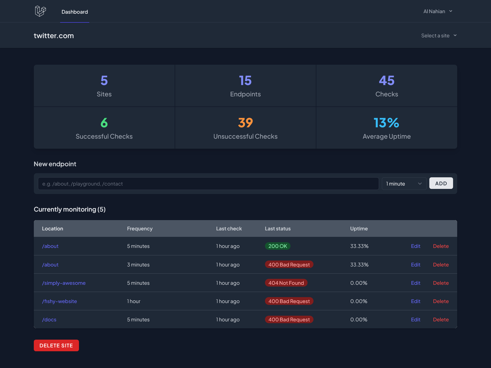

# Kordova - Uptime Monitoring Made Easy!


Kordova is an Uptime Monitor built with Laravel, Vue, and Inertia. Kordova allows you to create and switch between sites, add endpoints to monitor with frequency intervals, and _automatically alert specified email addresses when an endpoint goes down (upcoming feature)_. The project utilizes the power of scheduling, queues, and _real-time notifications (upcoming feature)_ to provide a robust monitoring system.

## Features

-   **Create and Switch Sites:** Easily create multiple sites and switch between them within the application.
-   **Add Monitored Endpoints:** Add endpoints to monitor with customizable frequency intervals.
<!-- -   **Automated Email Alerts:** Receive automatic email alerts when a monitored endpoint goes down. -->
-   **Laravel Queues:** Utilize Laravel queues to perform background processing and ensure smooth monitoring operations.
-   **Sub-Minute Schedules:** Work with sub-minute schedules in Laravel to perform actions on models at user-defined intervals.
<!-- -   **Channel Notifications:** Send out channel notifications using Laravel to keep users updated about monitoring events. -->
-   **API Resources:** Use API resources to simplify data transfer between the backend and frontend in the Inertia framework.
-   **Events and Observers:** Organize the application using events and observers to handle various actions and events.
-   **Vue Modals:** Create modals in Vue to enhance the user experience and provide interactive features.
-   **Inertia Forms:** Perform inline editing with Inertia forms to enable seamless data manipulation within the application.

...and many more!

## Screenshots


_Dashboard provides an overview of the monitored sites and their current status._

---


_Site selector dropdown helps to easily navigate through sites and also let user to add a new site._

---


_Site selector dropdown helps to easily navigate through sites and also let user to add a new site._

---


_Super simple modal easily let user to add a new site._

---


_Editing the endpoint never been this easier! Inline editing form let's user update an endpoint without any page reload._

---


_Site details page shows the monitored endpoints and their monitoring configurations._

---


_When something goes wrong and the uptime monitor detects the problem, it automatically stores the response body and pops up in a nice simple modal in the Endpoint details page._

## Installation

To get started with **Kordova**, follow these steps:

1. Clone the repository:

    ```shell
    git clone https://github.com/alnahian2003/kordova.git
    ```

2. Change into the project directory:

    ```shell
    cd kordova
    ```

3. Install the dependencies using Composer and NPM (make sure you have both installed):

    ```shell
    composer install
    npm install && npm run dev
    ```

4. Create a copy of the `.env.example` file and rename it to `.env`. Then, generate a unique application key:

    ```shell
    cp .env.example .env
    php artisan key:generate
    ```

5. Set up your database configuration in the `.env` file.

6. Run the database migrations and seed the database with default data:

    ```shell
    php artisan migrate --seed
    ```

7. Start the development server:

    ```shell
    php artisan serve
    ```

8. Access the application in your browser at `http://localhost:8000`.

## Acknowledgements

This Uptime Monitor is based on the concepts and techniques taught in the "[Build an Uptime Monitor with Laravel, Inertia, and Vue](https://codecourse.com/courses/build-an-uptime-monitor-with-inertia)" course. The course provides a comprehensive guide to building real-world applications with Inertia and is recommended for developers who want to enhance their skills in Laravel and Vue development.

If you're already working with Inertia, this project will provide valuable insights and practical examples to apply in your future projects.

## Contact

If you have any questions or inquiries about this project, feel free to reach out to me on [twitter](https://twitter.com/alnahian2003)
